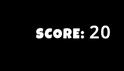

# Movie Quiz

[View published site on GitHub Pages](https://meldissa.github.io/p2-movie-quiz/).

Image from [Am I Responsive](http://ami.responsivedesign.is/).

## Project Overview

Movie Quiz is a website that aims to provide entertainment and a fun challenge to the user with a quiz game. This site has been created as part of my Portfolio Project 2 for Code Institute.

## Table of Contents

1. [User Experience (UX)](#ux)
    * [Strategy](#strategy)
        * [Project Goals](#project-goals)
        * [User Stories](#user-stories)
    * [Scope](#scope)
    * [Design](#design)
        * [Colours](#colours)
        * [Typography](#typography)
        * [Imagery](#imagery)
    * [Skeleton](#skeleton)
        * [Wireframes](#wireframes)
2. [Features](#features)
    * [Current Features](#current-features)
    * [Future Features](#future-features)
3. [Technologies Used](#tech-used)
4. [Testing](#testing)
    * [User Stories Testing](#user-testing)
    * [Validation Testing](#validation-testing)
    * [Known Issues and Resolutions](#issues)
5. [Deployment](#deployment)
6. [Credits](#credits)
7. [Acknowledgements](#acknowledgements)

## User Experience (UX) 

## Strategy 

### Project Goals 

The main business goal for Movie Quiz is to provide a fun challenge to the user via a quiz game. The site will test the user’s knowledge across 20 different questions in relation to popular movies and film. The user will also be able to receive an end score based on how many questions they answered correctly, with the opportunity to replay the quiz.

The main target audience for this website are games/quiz lovers with an extended interest in movies and film. This quiz game will allow the user to test their knowledge in a fun and entertaining manner.

### User Stories 

* __Site User Goals:__

    * I want to want to play an online quiz to test my knowledge on movies.
    * I want to easily locate the rules of the game and understand how to play the quiz game.
    * I want to see my progress whilst playing the quiz game.
    * I want to track my score during the quiz game of how many points I have.
    * I want to view my final score after quiz game has ended and to save this.
    * I want to replay the quiz game.
    * I want to view the highscores table of previously saved scores.
    * I want to clear the highscores to reset the table.
    * I want to have the option to quit the quiz game without finishing it.

* __Site Owner Goals:__

    * I want to provide a challenging quiz to entertain online users.
    * I want users to easily navigate through the site and game without encountering much difficulty.
    * I want users to return and replay the quiz.
    * I want users to record highscores to give incentive to return to replay the game to improve the score.

## Scope 

To achieve the strategy goals, I want to implement the following features:

* A Home page section, which will allow users to start the quiz game, to view the rules of the game, and view the highscores table of previously saved scores (if any).
* A Quiz Game section, which users can access once the game is started, the user is able to view the questions and available options which they can select to progress the quiz.
* A feature which lets the user know if selected answer is correct or incorrect, correct will turn the answer green and incorrect will turn the answer red.
* A score tracker during the quiz game, which allows the user to see their current score and this changes depending on if the question answered is correct.
* A progress feature during the quiz game, which allows the user to see how many questions have been answered out of the total questions and a progress bar for additional visual aspect.
* An End Quiz section, which notifies the user that the quiz game is finished and displays the final score, the user has also an option to save the score and return to the home page, or replay quiz or return back to the home page without saving the score.
* A Highscores section, which displays previously recorded scores to the user (top 10) noting the username and the score next to it, also allowing user to clear the table of all previously recorded scores.
* A fully responsive design that will work on different devices including desktop, tablets, and mobile devices, allowing users to access the site anytime and anywhere.

## Design 

### Colours 

The following colours have been used for the website:

* #fff
* #c20047
* #ffbb59
* black

These four main colours have been picked to compliment the main background image used for the website. I have also kept the colour choices simple and cohesive, to not overwhelm the user and keep the focus on the main content of the website.

### Typography 

The fonts were obtained from [Google Fonts](https://fonts.google.com/).

For my logo text and heading I have used Luckiest Guy.

For the main text I have selected Open Sans which complements the Luckiest Guy font used for my headings and logo. 

I have avoided using overly stylised fonts, which can be difficult to read for users, therefore ensuring the website is more accessible to users with visual impairments.

In the event the font fails to load, I have used sans-serif as a back-up font.

### Imagery 

Images are obtained from the [Freepik](https://www.freepik.com/) and [Flaticon](https://image.flaticon.com/icons/png/512/1038/1038100.png) website.

I have used imagery appropriate to the website’s content to provide a more visual experience to the user.

Please see further details in the __Credits__ section for the specific images used within the project.

## Skeleton 

### Wireframes 

Wireframes were created using [Balsamiq Wireframes](https://www.balsamiq.com/).

The wireframes have examples of desktop, tablet, and mobile phone displays.

* [Movie Quiz Wireframe](docs/images/movie-quiz-wireframe.png)

## Features 

### Current Features 

For this project I opted for a single page website with "shown" and "hidden' features activated depending on user input. This is fully responsive and consists of a Home section, Quiz Game section and the following modal sections: Rules, Highscores, Finish Quiz, Clear Scores, Play Again and Return Home.

__Home__: 

The home section consists of the main heading for the Movie Quiz game and a paragraph text section underneath to entice the user to play the quiz game. The user is provided with the option to start the quiz game, view the rules, and view the highscores table. Upon clicking the "Play" button, the user would be able to begin the quiz game. Clicking the "Rules" button displays a modal popup which allows the user to view and familiarise themselves with the quiz game. Clicking the "Highscores" button will display the table with the top 10 recorded highscores (this will be empty the first time visits the website as no scores would be saved yet).

__Quiz Game__:

Once the user initiates the game by clicking "Play" from the Home page section, they will be presented with the main quiz game section. The user is presented with a quiz question (this is random) and below are provided with 4 answer buttons of the possible answers. Once the user selects the desired answer button, it will turn either green if correct or red if incorrect to indicate whether this was answered correctly or not. Upon answering a question, the user will be shown the next set of questions until all the questions have been answered, and then the quiz game will end. Above the question, the user can view the progress bar which shows the current question out of the total and a visual progress bar to show how far along the quiz they are. In addition, the user is able to see their score which will update with every correct answer selected. The user is also given the option to quit the quiz game anytime by clicking the "Quit Game" button. Prior to exiting the game, they will be presented with a prompt modal to confirm their choice. 

__Finish Quiz Modal__:

The Finish Quiz modal is displayed once the game has ended (after the user has answered all 20 questions). The modal displays the final total score the user has earned during the quiz game, and provides the option to enter a username to save the score earned during the game. If the user chooses to save the score, this can then be accessed on the highscores table from the home page section. The user is also given the option to replay the quiz game, by clicking this button an additional prompt modal will be provided for the user to confirm their choice as the score will not be saved choosing this option. The user can also choose to return to the home section, and a prompt modal is also provided for this choice for the user to confirm as the score will not be recorded.

__Rules Modal__:

The Rules modal is accessed from the home page once the user clicks the "Rules" button. The purpose of this modal is to provide the user with the rules of the quiz game and explain the basic navigation of the website. The user can exit this modal by clicking "Close" which will return them to the home page.

__Highscores Modal__:

The Highscores modal is accessed from the home page once the user click the "Highscores" button. The purpose of this modal is to display the top 10 earned scores during the quiz game which have been saved. Upon first visit, this table will be empty as no scores have been saved yet, however once the user saved scores the table will display this in order of highest to lowest. If more than 10 scores are recorded then the lowest scoring will be replaced, if the new score earned is higher than the existing lowest on the table. The user can exit the modal by clicking "Close" which will return them back to the home page. The scores will remain recorded on the table if the user returns back to the website. The user has also got the option to clear the highscores earned by clicking the "Clear Scores" button, a prompt modal will be display for the user to confirm their choice. By selecting "Yes" the highscores table will be fully cleared from any previously recorded scores.

__Confirmation Modals__:

The Clear Scores, Play Again and Return Home modals act as a confirmation for the user choice which will have a direct consequence, and this acts as an additional barrier for user to confirm their choice and a warning of the consequence if the action taken. With the additional of the modals, I kept in mind the UX of the website, as sometimes the user can accidentally select a button, so with the addition of these modal this will stop any unwanted button pressing reducing the users experience. as the direct action will not be carried out without further user confirmation. For example, clearing the highscores table when the user does not want to do so.

### Future Features 

Due to time constraints, I was unable to apply additional features, in the future I would like to implement the following:

* Add more questions to the quiz. At the moment the quiz has a max of 20 questions available within the array and the quiz game itself uses all 20 of these questions. I would like to increase the number of questions available to use during the quiz game. For example, increase available questions to 100 and during the quiz game 20 of these questions are randomly selected. This will provide more incentive to the user to return and replay the quiz, and would provide a higher entertainment value as the user is able to play the game with set of new questions to keep it fresh and more interesting.
* Add additional visual feedback when the user selects the correct or incorrect answer. For example, a popup that will say 'correct' or 'wrong', this way the user will have additional feedback to say whether the answer was correct, as sometimes the user might be a bit slower to react or realise based on the current colour changes for the answer buttons whether their chosen answer was right or wrong. In addition, by including this visual feedback this can also help cut down the rules section to keep it much shorter and simpler, as this would be more self explanatory with the popup element.
* Add a timer element to the quiz to give the user a set timeframe to answer the question displayed.

## Technologies Used 

For this project the main languages used are __HTML5__, __CSS3__ and __JavaScript__.

I have also utilised the following frameworks, libraries, and tools:

* [Bootstrap v5.0.2](https://getbootstrap.com/): 
    * Bootstrap has been used for overall responsiveness of the website and for the layout with the addition of select classes.
* [jQuery](https://jquery.com/):
    * jQuery was used for additional function to display the modal sections in this project.
* [GitPod](https://www.gitpod.io/): 
    * I used GitPod as the IDE for this project and Git has been used for Version Control.
* [GitHub](https://www.github.com/): 
    * GitHub has been used to create a repository to host the project and receive updated commits from GitPod.
* [Balsamiq](https://balsamiq.com/): 
    * I used Balsamiq to create the wireframe for the website for the basic structure and layout.
* [Flaticon](https://www.flaticon.com/): 
    * I used Flaticon website to obtain the favicon image used for this project.
* [Freepik](https://www.freepik.com/): 
    * Freepik has been used for copyright free images for this project.
* [Google Fonts](https://getbootstrap.com/): 
    * I have used Google Fonts to import fonts for styling purposes for this project.
* [GIMP v2.10](https://www.gimp.org/): 
    * GIMP image manipulator program was used to change contrast for the background image used this project.
* [Chrome Dev Tools](https://developers.google.com/web/tools/chrome-devtools): 
    * Chrome Dev Tools was used to test the site, assist with debugging issues and run reports from Lighthouse.
* [W3C Markup Validation Service](https://validator.w3.org/): 
    * The W3C Markup Validation Service was used to validate the HTML document for this project and to identify any issues with the code.
* [W3C CSS Validation Service](https://jigsaw.w3.org/css-validator/): 
    * The W3C CSS Validation Service was used to validate the CSS document for this project and to identify any issues with the code.
* [JSHint Validation Service](https://jshint.com/): 
    * The JSHint Validation Service was used to validate the JavaScript document for this project and to identify any issues with the code.
* [Color Contrast Accessibility Validator](https://color.a11y.com/):
    * This was used to test the color contrast accessibility for this project.
* [Am I Responsive](http://ami.responsivedesign.is/):
    * Am I Responsive was used to create the header image for the README file.

## Testing 

### User Stories Testing 

From the Home page, the user is presented with the title 'Movie Quiz' and an introductory short paragraph to catch their attention and incentivise playing the quiz game. The user is able to select 'Play' to start the quiz game, 'Rules' to view the rules modal which explains the game, and 'Highscores' to view the modal popup for the highscores table.

When the user clicks the 'Play' button, they will be taken to the next screen where the quiz game has been initiated.

When the user clicks the 'Rules' button, a modal popup will appear on the screen and the user will be able to read the quiz rules. To return back to the Home page, the user can either click 'Close' or click off the modal to close this down.

When the user clicks the 'Highscores' button, a modal popup will appear on the screen and the user will be able to view the table with the 'Name' and 'Score' of previously saved scores. This table will be empty upon first visit as no user scores have been saved yet. To return back to the Home page, the user can either click 'Close' or click off the modal to close this down.

If the user has already played the quiz game and saved the final score, then this will be recorded in the highscores table. The table displays the top 10 scores, any new scores higher than the lowest top 10 score on the table will be added and the lowest score will be replaced. 

The user is also able to clear the scores table by selecting the 'Clear Scores' button. This removes all the recorded scores on the highscores table and the table will be reset and empty. Once the users clicks the 'Clear Scores' button, they will be provided with a prompt to confirm their choice. By clicking 'No' this will return the user back to the highscores table and no changes would have been made. By clicking 'Yes' the highscores table will be cleared and the user will be taken back to the now empty table. 

The following user stories have been achieved:

* I want to want to play an online quiz to test my knowledge on movies.
* I want to easily locate the rules of the game and understand how to play the quiz game.
* I want to view the highscores table of previously saved scores.
* I want to clear the highscores to reset the table.
* I want users to record highscores to give incentive to return to replay the game to improve the score.
* I want users to easily navigate through the site and game without encountering much difficulty.

Once the user has initiated the quiz game by clickig the 'Play' button from the Home page, they will be presented with the quiz game section.

The top left section shows the user their progress during the quiz. This is presented both visually via the progress bar which fills up as the user answers more questions, and is also presented in written format above the progress bar showing the user which questions of the max 20 they are currently on.

The top right section shows the user their score during the quiz game. The score begins with 0, and increases by 10 each time the user answers the question correctly. Any incorrect answers earn 0 points and therefore the score would not change in this instance. The user is able to track their total score during the game, as the score will automaticaly update once the user selects the correct answer.

In the top mid section the user is presented with the question, and below that they are presented with 4 answer buttons. On desktop, the user can hover over the answer buttons which will change the colour to indicate that the user can select this answer. On mobile, this feature was disabled to improve the overall UX (this is further discussed in the __Known Issues and Resolutions__ section). Once the user clicks on an answer button, this will turn green if the answer selected is correct, or this will turn red if the answer selected is incorrect. There is a short timeout added before the user is then presented with the next question, and then the same process will apply.

At the bottom of the quiz game section, there is a 'Quit Game' button, the user has the option to end the quiz game early without finishing it. By clicking the 'Quit Game' button, the user will be presented with a popup modal to confirm their choice, selecting 'No' will return them back to the quiz game and no progress would be lost, selecting 'Yes' will return the user back to the Home page and all progress will be lost.

The following user stories have been achieved:

* I want to see my progress whilst playing the quiz game.
* I want to track my score during the quiz game of how many points I have.
* I want to have the option to quit the quiz game without finishing it.
* I want to provide a challenging quiz to entertain online users.

After the user has answered all 20 questions, the quiz game will end and the user will be displayed with the finish quiz game modal. The user will be notified that they have reached the end of the quiz game. The user will be presented with the final total score that they have accumulated during the quiz game out of the max total achievable points. The user is then prompted to enter their name to be able to save the score earned during this game. If the user has not entered a name, then the 'Save Score' button is disabled and does not allow the user to save the score.

Once the user has entered a name in the input field, then the 'Save Score' button becomes available and the user is able to click this. By clicking the 'Save Score' button, the final score will be saved and the user will be taken back to the Home page. If the user now clicks on the "Highscores' button, the table will display their score along with the name entered. If the table already has 10 max recorded top scores, then the user's new score will only be visible if they have scored higher than the previusly recorded scores, then this will be replaced accordingly. 

From the finish quiz modal, the user also has the option to replay the quiz via the 'Play Again' button. By clicking 'Play Again', the user will be presented with the modal popup to confirm their choice. Selecting 'No' will return the user back to the finish quiz modal, selected 'Yes' will start the quiz game again and all unsaved progress will be lost.

From the finish quiz modal, the user also has the option to return to the home page without saving the quiz via the 'Return Home' button. By clicking 'Return Home', the user will be presented with the modal popup to confirm their choice. Selecting 'No' will return the user back to the finish quiz modal, selected 'Yes' will take the user back to the Home page and all unsaved progress will be lost.

The following user stories have been achieved:

* I want to view my final score after quiz game has ended and to save this.
* I want to replay the quiz game.
* I want users to return and replay the quiz.
* I want users to record highscores to give incentive to return to replay the game to improve the score.

### Validation Testing 

To test the HTML code, I used the __W3C Markup Validation Service__:

No errors were detected in the code. There is 1 warning displayed for the h4 tag missing text, however this has been left empty as the text has been added via JavaScript to populate the empty space.

To test the CSS code, I used the __W3C CSS Validation Service__:

No errors were detected in the code.

To test the JavaScript code, I used the __JSHint Validation Service__:

No errors were detected in the code. Warnings were detected in the code, however this was due to the use of the new ES6 syntax in the code.

I also used the __Chrome Dev Tools Lighthouse Report__ to test both on desktop and mobile.

For the desktop, no issues were detected, all sections were above 90:

For the mobile, no issues were detected, all sections were above 90:

I also tested the website colour contrast using the __Color Contrast Accessibility Validatory__:

No issues were detected.

This website was tested on the following browsers:

* Google Chrome
* Safari
* Mozilla Firefox

This website was also tested on the following devices:

* iPhone 11 Pro
* iPhone X
* iPad Pro
* MacBook Air
* Android One Plus 8 Pro

### Known Issues and Resolutions 

* During testing an issue was identified within the Finish Quiz modal, where the final score was not being displayed correctly. The score displayed was showing the previous game score rather than the current game score that the user has obtained. After further investigation, it was idenitfied that the issue was within the script.js file, once the game had ended the score was set to the local storage and the modal was returned. The finalScore variable was then set to get the score from the local storage, however, this was pulling the incorrect score. To resolve this issue, the finalScore variable was placed within the function that increments the score during the quiz and was set to return that score. I removed the code which set and retrieved the score to and from the local storage. After testing this once more the issue was now resolved, and once the user reaches the end of the quiz game the final score is now displayed correctly for the total score that the user has earned during the current game.

* During testing an issue was identified within the main Quiz Game section. In the script.js file, any correct or incorrect answers selected by the user would have the relevant style class applied to change the colour, green if correct or red if incorrect. However, once the answer was selected, the answer button did not change to the relevant colour, instead the surrounding area in between the buttons would have the style class applied to change the colour. After further inspection, it was identified that the style class is being applied to the parent element of the answer button variable which is the div containing all the answer buttons. Hence, why the colour change was displaying incorrectly as the style class was applied to the div rather than the answer buttons. To resolve this issue, I changed the code in the script.js to ensure the style class is applied to the answers buttons. Further testing was completed, and the answer buttons now correctly have the style applied to change the colour depending if the correct or incorrect answer is selected by the user.

* An additional issue was identified within the main Quiz Game section. The answer buttons have a hover style applied, when the user hovers over the available answers this will change the colour. However, once the user selects the answer and the new class style is applied for correct or incorrect answer, the hover style is still in effect. Therefore, if the user is still hovering over the answer button they will not be able to see whether the answer was correct or incorrect, unless the pointer is moved away from the answer button. This affected the UX of the quiz game. To resolve the issue, I added additional style classes to separate the answer buttons from the other buttons on the website. Then I added additional code in the script.js, when the user selects the answer the hover style would be removed from the button and the correct/incorrect style class applied. Now, when the user selects the answer button, the hover style is removed and they are able to view whether the answer is correct or incorrect. This is then reset again once the user is presented with a new question, so the hover style works once more until the user selects the next answer.

* During testing for the mobile devices a UX issue was identified, where the hover style is in effect. Once the user clicks the button on a mobile device to select their answer during the quiz game, the answer will have the correct class applied to change colour. However, once the next questions is presented the hover style is applied to the button the user selected last. To resolve this issue, I added a media query for hover: none to the style.css. Therefore, when the user selects the answer buttons on mobile devices the hover effect won't be in place to distract from the answer buttons selected once the next questions starts. The answer buttons are now displayed all in the same colour and will change only upon the user selecting the correct or incorrect answer.

* My family and friends assisted with further testing of the website. Feedback was received regarding the UX of the website where at the end of the quiz the final total score is displayed. Feedback provided suggested to add the final score user has earned out of the overall max total that is possible to achieve in the quiz, so the user is able to see how well they have played during the quiz game. To improve the UX as per the suggested feedback, I added additional text to the h3 tag in the index.html where the final score is displayed to say '(user score) out of 200'. The final user score placeholder text was wrapped in a span tag, to ensure the user score is updated within the span and the outside text is unaffected as this does not change.

## Deployment 

The project was developed using GitPod and was deployed via the GitHub repository to GitHub Pages.

The following steps were followed to deploy this project:

1. Select 'Settings' from the GitHub repository.
2. Select 'Pages' from the options available on the left-hand side.
3. In the GitHub Pages section, under the 'Source', select 'master' from the dropdown.
4. This will change the branch to 'master', then click 'Save' and this will generate the URL.
5. Refresh the page and the site is published and ready to use.
6. Click on the URL for and confirm it has been published.

__Clone Project__:

1. Select the 'Repository' for the project from the GitHub dashboard.
2. Click on the 'Code' button.
3. From the dropdown:
    * To clone the repository using HTTPS, under "Clone with HTTPS", click the copy icon next to the link. 
    * To clone the repository using an SSH key, including a certificate issued by your organization's SSH certificate authority, click Use SSH, then click the copy icon next to the link.
    * To clone a repository using GitHub CLI, click Use GitHub CLI, then click the copy icon next to the link.
4. Open Terminal.
5. Change the current working directory to the location where you want the cloned directory.
6. Type git clone, and then paste the URL you copied earlier.
7. Press Enter to create your local clone.

__Run Project Locally__:

1. Select the 'Repository' for the project from the GitHub dashboard.
2. Click the 'Code' button, and from the dropdown select 'Download ZIP'.
3. Extract the downloaded ZIP file on your computer.
4. Open the folder with the files and proceed to open the 'index.html' file in the web browser.

## Credits 

### Content

The quiz questions used for this project were obtained from the following sources:

* [kindadl](https://kidadl.com/articles/easy-movie-trivia-questions-and-answers-for-family-movie-night)
* [parade](https://parade.com/977752/samuelmurrian/movie-trivia/)
* [dailyrecord](https://www.dailyrecord.co.uk/lifestyle/100-movie-tv-quiz-questions-23212715)

### Media

The images used for this project were obtained from the following sources:

* Background Image - from [Freepik](https://img.freepik.com/free-photo/stylish-arrangement-popcorn-tickets_23-2147807342.jpg?size=626&ext=jpg)
* Favicon Image - from [Flaticon](https://image.flaticon.com/icons/png/512/1038/1038100.png)

### Code

* The script.js document was created using the following tutorial on [YouTube](https://www.youtube.com/watch?v=f4fB9Xg2JEY&amp;t=3763s&amp;ab_channel=BrianDesignBrianDesign). I have borrrowed code from this tutorial to assist with creating the quiz game. Please note some of the borrowed code has been customised by me to fit this project. I have also added my own code for additional functions for the project.

* [Bootstrap v5.0.2](https://getbootstrap.com/) framework was used in this project to implement certain components for the website:
    * [Grid System](https://getbootstrap.com/docs/5.0/layout/grid/): The grid system was implemented for the overall responsiveness of the website.
    * [Modal](https://getbootstrap.com/docs/5.0/components/modal/): The modal classes were used to create the different sections of this website.
    * [Progress Bar](https://getbootstrap.com/docs/5.0/components/progress/#multiple-bars): The progress bar classes were used for the main quiz game section.
    * [Buttons](https://getbootstrap.com/docs/5.0/components/buttons/): The button classes were used for general styling.
    * [Form](https://getbootstrap.com/docs/5.0/forms/overview/): The form classes were used for general styling.

## Acknowledgements 

* I would like to thank my family and friends for their support throughout this project and for assisting with the testing stage and providing valuable feedback.
* The Tutor Support team, especially Scott, who greatly assisted me on an issue with my final score display on the javascript file.
* My mentor, Guido Cecilio, for being of great support and providing valuable guidance and feedback throughout this process.